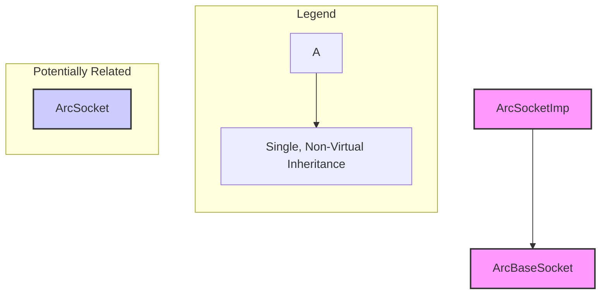

# C++ RTTI Analysis: ArcSocket, ArcBaseSocket, ArcSocketImp

## Introduction to RTTI

Run-Time Type Information (RTTI) is a C++ mechanism that allows the type of an object to be determined during program execution. This is essential for features like `dynamic_cast<>` (safely casting pointers/references within an inheritance hierarchy) and `typeid()` (obtaining type information about an object).

Compilers that support RTTI, like Microsoft Visual C++ (MSVC), embed specific data structures within the binary, typically in read-only data sections (like `.rdata`). These structures encode the class names and their inheritance relationships. RTTI is primarily generated for *polymorphic* classes – those that have at least one virtual function or inherit from a class with virtual functions.

The core MSVC RTTI structures involved are:

1.  **`TypeDescriptor`**: Contains the mangled name of the class and a pointer to the `type_info` base class's virtual function table (vtable).
2.  **`_s__RTTICompleteObjectLocator`**: The central structure associated with a specific vtable. It points to the `TypeDescriptor` and the `ClassHierarchyDescriptor`. A pointer to this locator structure is usually found immediately preceding the vtable pointer in the `.rdata` section.
3.  **`_s__RTTIClassHierarchyDescriptor`**: Describes the inheritance hierarchy for a class, including flags for multiple/virtual inheritance and a pointer to an array of base class descriptors.
4.  **`_s__RTTIBaseClassDescriptor`**: Describes a single base class within the hierarchy, including its type, inheritance attributes, and offset information.

By locating and parsing these structures, we can reconstruct the inheritance relationships between polymorphic classes in the binary.

## Summary of Findings for Arc* Classes

*   The vtable previously thought to belong to `ArcSocketImp` at `0x15444d0` actually belongs to `ArcBaseSocket`.
*   `ArcBaseSocket` inherits non-virtually from a single base class: `ArcSocketImp`. This is a direct, single inheritance relationship.
*   `ArcSocketImp`, based on its RTTI descriptors within the `ArcBaseSocket` hierarchy, does not appear to have any further RTTI-tracked base classes.
*   `ArcSocket` (identified by its `TypeDescriptor` at `0x16ce928`) also does not appear to have any RTTI-tracked base classes, as its `ClassHierarchyDescriptor` pointer is NULL. Its relationship to `ArcBaseSocket` or `ArcSocketImp` is not directly revealed by the analyzed RTTI hierarchy descriptors, though naming suggests a potential relationship (perhaps `ArcSocket` is an interface implemented by `ArcSocketImp`, or `ArcSocket` uses `ArcBaseSocket`). The unusual NULL pointer at `0x158ee98` might indicate this RTTI information is used in a specific context rather than being tied directly to the primary vtable for `ArcSocket`.

## Detailed Analysis

### 1. ArcSocket (`.?AVArcSocket@@`)

*   **TypeDescriptor Address:** `0x16ce928` (Located in `.data` section)
    *   `0x16ce928`: `0x01581ba8` (Pointer to `type_info` vftable - common for all `TypeDescriptor`s)
    *   `0x16ce92c`: `0x00000000` (Spare - typically unused)
    *   `0x16ce930`: `.` -> Start of null-terminated name string `.?AVArcSocket@@`
*   **RTTICompleteObjectLocator Address:** `0x158ee9c` (Located in `.rdata` section, inferred from XREF `0x158eea8`)
    *   `0x158ee9c`: `0x016ce5c0` (`signature` - Non-zero, points into `.data`. Meaning unclear without deeper compiler knowledge, might relate to specific usage or version.)
    *   `0x158eea0`: `0x0158ee78` (`offset` - Offset of the associated vtable within the complete object layout. Points 36 bytes before this locator.)
    *   `0x158eea4`: `0x00000000` (`cdOffset` - Constructor displacement offset, 0 is common for primary vtables.)
    *   `0x158eea8`: `0x016ce928` (`pTypeDescriptor` -> Points correctly to `ArcSocket` TypeDescriptor)
    *   `0x158eeac`: `0x00000000` (`pClassHierarchyDescriptor` -> **NULL**)
*   **Interpretation:** The NULL `pClassHierarchyDescriptor` strongly indicates `ArcSocket` has no base classes tracked by RTTI. The memory location `0x158ee98`, where a pointer *to* this locator would typically reside immediately before a vtable, was found to be NULL. This suggests this specific locator might not be paired with the primary vtable used during `ArcSocket` construction, or the layout deviates slightly here.

### 2. ArcBaseSocket (`.?AVArcBaseSocket@@`)

*   **VTable Address:** `0x15444d0` (Located in `.rdata`. Pointer to its Locator is at `0x15444cc`)
*   **RTTICompleteObjectLocator Address:** `0x0158e4a0` (Located in `.rdata`)
    *   `0x0158e4a0`: `0x00000000` (`signature` - Standard value)
    *   `0x0158e4a4`: `0x00000000` (`offset` - VTable is at the start of the object layout)
    *   `0x0158e4a8`: `0x00000000` (`cdOffset` - Standard value)
    *   `0x0158e4ac`: `0x016cd818` (`pTypeDescriptor` -> Points to `ArcBaseSocket` TypeDescriptor)
    *   `0x0158e4b0`: `0x0158e488` (`pClassHierarchyDescriptor` -> **Non-NULL**, indicates base classes exist)
*   **TypeDescriptor Address:** `0x016cd818` (Located in `.data`)
    *   `0x016cd818`: `0x01581ba8` (Pointer to `type_info` vftable)
    *   `0x016cd81c`: `0x00000000` (Spare)
    *   `0x016cd820`: `.` -> Start of name string `.?AVArcBaseSocket@@`
*   **ClassHierarchyDescriptor Address:** `0x0158e488` (Located in `.rdata`)
    *   `0x0158e488`: `0x00000000` (`signature` - Standard value)
    *   `0x0158e48c`: `0x00000000` (`attributes` -> Bit 0=0 (no multiple inheritance), Bit 1=0 (no virtual inheritance))
    *   `0x0158e490`: `0x00000002` (`numBaseClasses` -> Total of 2 classes in this hierarchy branch: `ArcBaseSocket` itself + 1 direct base)
    *   `0x0158e494`: `0x0158e478` (`pBaseClassArray` -> Pointer to the array of base class descriptor pointers)
*   **BaseClassArray Address:** `0x0158e478` (Located in `.rdata`)
    *   `0x0158e478`: `0x0158e458` (Pointer to `RTTIBaseClassDescriptor` for `ArcBaseSocket` itself)
    *   `0x0158e47c`: `0x0158e438` (Pointer to `RTTIBaseClassDescriptor` for the direct base class)
*   **Interpretation:** `ArcBaseSocket` uses single, non-virtual inheritance from one direct base class.

### 3. ArcSocketImp (`.?AVArcSocketImp@@`)

*   **Identified As:** The direct base class of `ArcBaseSocket`.
*   **BaseClassDescriptor Address (within ArcBaseSocket hierarchy):** `0x0158e438` (Located in `.rdata`)
    *   `0x0158e438`: `0x016cd7e8` (`pTypeDescriptor` -> Points to `ArcSocketImp` TypeDescriptor)
    *   `0x0158e43c`: `0x00000000` (`numContainedBases` - Indicates `ArcSocketImp` itself has 0 direct bases in *its* definition)
    *   `0x0158e440`: `0x00000000` (`PMD.mdisp` -> Member displacement is 0, meaning `ArcSocketImp` subobject starts at offset 0 within `ArcBaseSocket`)
    *   `0x0158e444`: `-1` (`PMD.pdisp` -> Virtual base table pointer displacement is -1, confirming non-virtual inheritance)
    *   `0x0158e448`: `0x00000000` (`PMD.vdisp` - Displacement inside virtual base table, irrelevant here)
    *   `0x0158e44c`: `0x00000000` (`attributes` - Flags describing this specific inheritance link)
    *   `0x0158e450`: `0x00000000` (`pClassDescriptor` -> **NULL**, suggests `ArcSocketImp` has no RTTI-tracked base classes *of its own*)
*   **TypeDescriptor Address:** `0x016cd7e8` (Located in `.data`)
    *   `0x016cd7e8`: `0x01581ba8` (Pointer to `type_info` vftable)
    *   `0x016cd7ec`: `0x00000000` (Spare)
    *   `0x016cd7f0`: `.` -> Start of name string `.?AVArcSocketImp@@`
*   **Interpretation:** `ArcSocketImp` is the direct, non-virtual base class of `ArcBaseSocket`, located at the beginning of the `ArcBaseSocket` object layout. `ArcSocketImp` itself appears to be a base class in this context (or potentially standalone) with no further RTTI-defined base classes.

## Inferred Hierarchy



*   **Solid Line:** Direct, non-virtual inheritance confirmed by RTTI.
*   **Dashed Box:** `ArcSocket`'s relationship is unclear from hierarchy data alone.

## Ghidra Data Structure Suggestions

Defining these structures in Ghidra's Data Type Manager allows for easier navigation and understanding of the RTTI data. Apply these structures to the addresses identified above.

```c
// Based on common MSVC RTTI structures (adjust sizes/types for specific architecture, e.g., use ulonglong for 64-bit pointers)

// Found at 0x16ce928, 0x016cd818, 0x016cd7e8
// Represents the C++ type_info structure or derived from it.
struct TypeDescriptor {
    pointer pVFTable; // Pointer to type_info's vftable (e.g., 0x01581ba8). Should point to a known vtable for type_info.
    dword   spare;    // Typically NULL, reserved.
    char    name[0];  // Mangled name string (null-terminated). Size is variable. Ghidra can represent this as a zero-length array, and the actual string data follows.
};

// Found at 0x158ee9c, 0x0158e4a0
// Locator structure placed before the vtable pointer in .rdata. Points to type and hierarchy info.
struct _s__RTTICompleteObjectLocator {
    dword signature;    // Usually 0 for base classes, 1 for classes with virtual bases (x64). Can vary.
    dword offset;       // Offset of the vtable pointer within the complete object. Non-zero often implies multiple inheritance or virtual bases.
    dword cdOffset;     // Constructor displacement offset. If non-zero, used during construction/destruction.
    pointer pTypeDescriptor; // Pointer to the TypeDescriptor for this class. *Crucial link*.
    pointer pClassHierarchyDescriptor; // Pointer to ClassHierarchyDescriptor. NULL if no RTTI base info.
    // Optional (later MSVC versions/x64?): pointer pSelf; // Pointer back to this structure. Check size if applying.
};

// Found at 0x0158e488
// Describes the overall inheritance structure (multiple, virtual) and points to base class details.
struct _s__RTTIClassHierarchyDescriptor {
    dword signature;      // Usually 0.
    dword attributes;     // Flags: Bit 0 (0x1) = multiple inheritance, Bit 1 (0x2) = virtual inheritance.
    dword numBaseClasses; // Number of base classes in the pBaseClassArray (includes the class itself). Determines array size.
    pointer pBaseClassArray; // Pointer to array of pointers. Array size is numBaseClasses * sizeof(pointer).
};

// Pointed to by entries in pBaseClassArray (e.g., at 0x0158e458, 0x0158e438)
// Describes a single base class within the hierarchy.
struct _s__RTTIBaseClassDescriptor {
    pointer pTypeDescriptor; // Pointer to TypeDescriptor of the base class this entry represents.
    dword   numContainedBases; // Number of direct base classes *of this base class*. Used for traversal.
    struct {
        int mdisp; // Member displacement: Offset of this base class subobject within the derived class.
        int pdisp; // Vbptr displacement: Offset of the virtual base pointer (-1 if not virtual inheritance).
        int vdisp; // Vfptr displacement: Offset of the virtual base pointer within the vbtable.
    } PMD; // Pointer-to-member displacement info. Critical for understanding layout.
    dword   attributes; // Flags describing the inheritance relationship (e.g., is base class public/protected/private, is ambiguous).
    pointer pClassDescriptor; // Pointer to the base class's own ClassHierarchyDescriptor. Allows recursive hierarchy traversal. NULL if the base has no further RTTI bases.
};
```

**Applying Structures in Ghidra:**

1.  Define the C structures above in the Data Type Manager. Ensure pointer sizes match the binary's architecture (e.g., `pointer32` or `pointer64`).
2.  For `TypeDescriptor`, after applying the structure, manually define the `name` field as a null-terminated string (`string`) of the appropriate length at the address immediately following `spare`.
3.  Navigate to the identified addresses for each structure type.
4.  Use `Data -> Choose Data Type...` (or press `T`) and select the corresponding structure definition.
5.  For `pBaseClassArray` at `0x0158e478`, define it as an array of 2 pointers (`pointer[2]`). Then, follow each pointer (`0x0158e458`, `0x0158e438`) and apply the `_s__RTTIBaseClassDescriptor` structure there.
6.  Ghidra should automatically interpret the pointer fields, allowing easy navigation between the related RTTI structures.

## Automating RTTI Discovery in Ghidra (Scripting Approach)

While Ghidra's built-in RTTI analyzer might not work perfectly in all cases (especially with variations or stripped binaries), you can definitely automate parts of this discovery using Ghidra's scripting capabilities (Python/Jython or Java). Here's a high-level approach:

1.  **Identify Potential VTable Pointers:**
    *   Scan the read-only data sections (like `.rdata`) for pointers that point *back* into the same read-only section. VTable pointers often exhibit this characteristic.
    *   Refine this by looking for sequences of pointers where subsequent pointers point to executable code sections (the virtual functions).
2.  **Locate Potential `RTTICompleteObjectLocator` Pointers:**
    *   For each potential vtable start address (`vtable_addr`), check the data immediately preceding it (`vtable_addr - sizeof(pointer)`). This preceding data should be a pointer (`locator_ptr`).
3.  **Validate `RTTICompleteObjectLocator`:**
    *   Read the structure at `locator_ptr` using the `_s__RTTICompleteObjectLocator` definition.
    *   Check if `locator_ptr->pTypeDescriptor` is a valid pointer.
    *   Read the `TypeDescriptor` structure at `locator_ptr->pTypeDescriptor`.
    *   Check if `TypeDescriptor->pVFTable` points to a known `type_info` vtable (this might require finding the `type_info` vtable first, perhaps by known symbol or signature).
    *   Check if `TypeDescriptor->name` starts with the expected mangling prefix (e.g., `.?AV` for MSVC classes). Ghidra API functions like `getDataAt()`, `getBytes()`, `getString()` are useful here.
4.  **Parse Hierarchy (Recursive):**
    *   If the `RTTICompleteObjectLocator` is valid and `locator_ptr->pClassHierarchyDescriptor` is not NULL:
        *   Read the `_s__RTTIClassHierarchyDescriptor` structure.
        *   Read `numBaseClasses`.
        *   Read the `pBaseClassArray` (an array of `numBaseClasses` pointers). Use Ghidra's API to read memory based on calculated sizes.
        *   For each pointer (`base_desc_ptr`) in the array:
            *   Read the `_s__RTTIBaseClassDescriptor` structure at `base_desc_ptr`.
            *   Extract the base class `TypeDescriptor` pointer (`base_desc_ptr->pTypeDescriptor`) and read the base class name.
            *   Record the inheritance relationship (using `PMD` and `attributes`).
            *   Recursively call the hierarchy parsing function using `base_desc_ptr->pClassDescriptor` if it's not NULL.
5.  **Apply Data Types:**
    *   Once structures are validated, use Ghidra API functions like `createData()` or `applyStructure()` to apply the defined data types at the correct addresses. This makes the analysis visible in the Ghidra UI.

**Handling Variable Sizes:**

*   **`TypeDescriptor.name`**: Read the fixed part (`pVFTable`, `spare`). Then, use `createStringData()` or similar API calls starting at `TypeDescriptor_addr + 8` to define the null-terminated string.
*   **`pBaseClassArray`**: Read `numBaseClasses` from the `ClassHierarchyDescriptor`. Calculate the array size (`numBaseClasses * sizeof(pointer)`). Read that many bytes from `pBaseClassArray` address and interpret each chunk as a pointer.

This automated approach can significantly speed up the process of identifying and structuring RTTI across a large binary.
